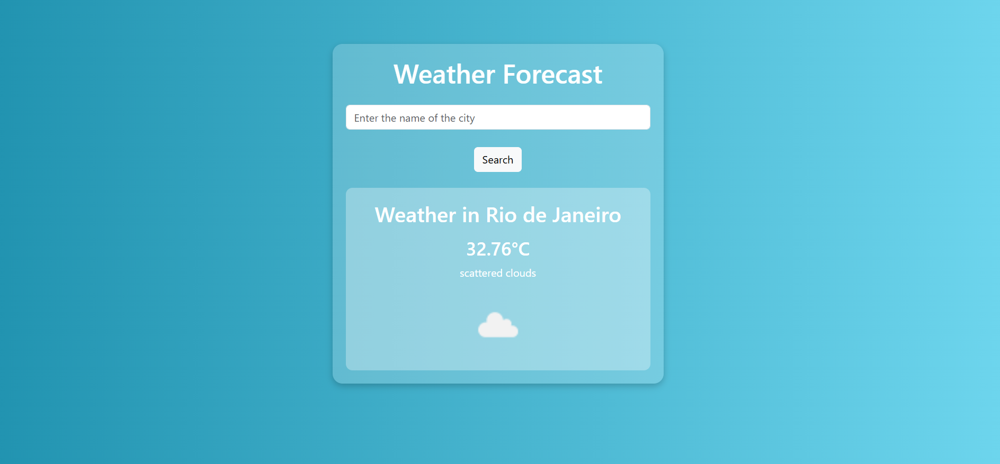

# Weather Forecast App 🌦️

## Description
This is a simple weather forecast application built with **Node.js, Express, and EJS**. It allows users to search for a city and retrieve the current temperature, weather description, and an icon representing the weather conditions. The app fetches real-time weather data from the **OpenWeatherMap API**.

---

## Features 🚀
- Search for the weather by city name.
- Displays temperature, weather description, and an icon.
- Uses **EJS** for templating.
- Styled with **Bootstrap**.
- Handles errors when a city is not found or when there's a connection issue.

---

## Technologies Used 🛠️
- **Node.js**
- **Express.js**
- **EJS (Embedded JavaScript Templates)**
- **Body-parser**
- **Bootstrap (via Cloudflare CDN)**
- **OpenWeatherMap API**

---

## Installation 🏗️

### 1️⃣ Clone the repository
```sh
git clone https://github.com/your-username/weather-app.git
cd weather-app
```

### 2️⃣ Install dependencies
```sh
npm install
```

### 3️⃣ Run the application
```sh
node app.js
```

### 4️⃣ Open in browser
Go to **http://localhost:3002**

---

## Project Structure 📂
```
weather-app/
│── assets/           # Folder for images
│   ├── time.png      # Weather-related image
│── public/           # Static files (CSS, JS, etc.)
│   ├── css/          # Stylesheets
│   │   ├── style.css # Custom styles
│── views/            # EJS templates
│   ├── index.ejs     # Main page template
│── app.js            # Main server file
│── package.json      # Project dependencies
│── README.md         # Documentation
```

---

## API Key 🔑
This application requires an **API key** from OpenWeatherMap. Replace the `apiKey` value in `app.js` with your own API key:

```js
const apiKey = 'YOUR_API_KEY_HERE';
```

To get an API key, visit: [https://home.openweathermap.org/api_keys](https://home.openweathermap.org/api_keys)

---

## Screenshot 🖼️



---

## License 📜
This project is open-source and available under the **MIT License**.

---

## Author 👩‍💻
Clariana Abreu - [Your GitHub Profile](https://github.com/abreuclariana)

---

## Future Improvements 🔮
- Add a **5-day weather forecast**.
- Implement a **geolocation feature** to get the user's current weather automatically.
- Improve the **UI/UX design**.
- Support for **multiple languages**.

---

### Feel free to contribute! 🤝


